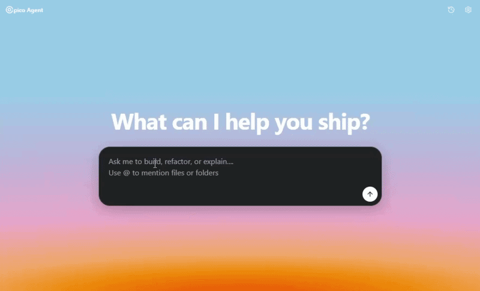

<div align="center">


# Opico Agent

**A full-stack, autonomous AI coding agent built as a VS Code extension**

[](https://opensource.org/licenses/MIT)
[](https://marketplace.visualstudio.com/)
[](https://www.typescriptlang.org/)
[](https://vitejs.dev/)
[](https://sdk.vercel.ai/)

</div>

<div align="center">

</div>

---

## Overview

**Opico Agent** is a fully autonomous AI coding assistant that lives inside your VS Code sidebar. 

Powered by the Vercel AI SDK, it utilizes a custom-built streaming agent loop to iteratively explore your codebase, execute commands, and refactor files. Whether you prefer Anthropic, OpenAI, Google Gemini, or a local open-source model, Opico Agent adapts to your workflow with a polished React UI, real-time diff previews, and a safe command execution gate.

## ✨ Features

*   **Autonomous Multi-Step Execution:** Give the agent an objective, and it will iterate up to 25 times per session—chaining tools, reading context, and verifying results autonomously.
*   **Provider Agnostic:** Out-of-the-box support for the leading AI providers plus 50+ pre-configured models. Easily plug in any OpenAI-compatible endpoint for local offline inference (e.g., Ollama, LM Studio).
*   **File Mention Autocomplete (`@`):** Instantly pull files or folders into the LLM context using `@` in the prompt box, backed by a fuzzy scoring engine and smart `.gitignore` filtering.
*   **Persistent Branching History:** All conversations are saved natively to VS Code. You can branch a conversation from any previous message to explore a different architectural path without losing context.
*   **Live Action & Reasoning:** Watch the agent think and act in real-time. Reasoning traces are tucked into collapsible blocks, and tool executions merge seamlessly into the chat stream.

### Built-in Workspace Tools

Opico Agent comes equipped with a core set of file-system tools allowing it to act as an independent developer:

| Tool | Capability | Safety & UX |
|------|-------------|-------------|
| `read_file` | Reads files with optional line-range pagination | Line-numbered output with header showing range context |
| `replace_in_file` | Search/Replace file editing | Validates uniqueness of search block, previews diff stats |
| `execute_command` | Shell command execution | **Requires User Approval**, output truncation for safety |
| `search_workspace` | Full-text regex search | Bundles `@vscode/ripgrep` for lightning-fast matching |
| `list_directory` | Directory tree listing | Recursive with configurable max depth |

## ⚙️ Configuration

Set up your preferred provider, model, and API keys via the extension's Settings modal (the gear icon) or through your VS Code `settings.json`:

| Setting | Description | Default |
|---------|-------------|---------|
| `opico-agent.modelProvider` | AI provider (`anthropic`, `openai`, `google`, `vertex`, `openai-compatible`) | `anthropic` |
| `opico-agent.modelName` | Model identifier (e.g., `claude-3.5-sonnet`, `gpt-4o`) | `claude-3-5-sonnet-20241022` |
| `opico-agent.apiKey` | Provider API key (securely falls back to env vars) | — |
| `opico-agent.apiBaseUrl` | Custom endpoint URL for OpenAI-compatible providers | — |

---

## 🛠️ Under the Hood (Architecture & Engineering)

Opico Agent spans two distinct build targets communicating over a typed bidirectional message bridge: a **Node.js extension host** (esbuild-bundled TypeScript) and a **React webview frontend** (Vite + Tailwind v4).

### System Architecture

```text
┌─────────────────────────────────────────────────────────────┐
│                    VS Code Extension Host                   │
│                                                             │
│ extension.ts ──► ChatWebviewProvider ◄──► AgentService      │
│                       │                         │           │
│                       │                 ┌───────┴───────┐   │
│                       │                 │ ToolRegistry  │   │
│                       │                 │  ┌─────────┐  │   │
│                       │                 │  │BaseTool │  │   │
│                       │                 │  │(generic)│  │   │
│                       │                 │  └────┬────┘  │   │
│                       │                 │  ┌────┴────┐  │   │
│                       │                 │  │5 Tools  │  │   │
│                       │                 │  └─────────┘  │   │
│                       │                 └───────────────┘   │
│                       │                         │           │
│             CommandApprovalManager              │           │
│             (pending/allow/deny/abort)          │           │
│                       │                                     │
│             VS Code GlobalState                             │
│             (conversation persistence)                      │
└───────────────────────┬─────────────────────────────────────┘
                        │ postMessage bridge (typed)
┌───────────────────────┴─────────────────────────────────────┐
│                    React Webview (Vite)                     │
│                                                             │
│ App.tsx ──► useExtensionBridge (state machine hook)         │
│               │                                             │
│     ┌─────────┼─────────┬──────────────┐                    │
│     ▼         ▼         ▼              ▼                    │
│ ChatMessage ToolBadge HistoryPanel PromptInputBox           │
│ (markdown + (diff     (slide-over  (@ file                  │
│  reasoning)  preview)  panel)       autocomplete)           │
└─────────────────────────────────────────────────────────────┘
```

### Engineering Highlights

*   **Type-Safe Tool System:** Every tool extends a generic `BaseTool<T>` abstract class where `T` is a **Zod schema**. This provides compile-time type safety (`execute(params: z.infer<T>)`) and runtime validation, seamlessly bridging TypeScript interfaces to LLM function calling.
*   **Command Approval Lifecycle:** Shell execution features a pending → approved/executing → done state machine. Handled by the `CommandApprovalManager`, users can allow, deny, or abort running processes natively from the React UI.
*   **Event-Driven Streaming:** The AI stream utilizes the `fullStream` async iteration API. Text deltas, reasoning chunks, and tool-call states are dispatched individually across the `postMessage` bridge for fluid, real-time UI rendering without bubble-wrapping.

### Project Structure
```text
opico-agent/
├── src/                          # Extension (Node.js) source
│   ├── extension.ts              # Activation entry point
│   ├── llm/
│   │   └── AgentService.ts       # Agent loop, provider factory, streaming
│   ├── providers/
│   │   └── ChatWebviewProvider.ts # Webview bridge, history, file scanning
│   ├── tools/
│   │   ├── BaseTool.ts           # Generic abstract base class
│   │   ├── ToolRegistry.ts       # Tool registration & AI SDK adapter
│   │   └── CommandApprovalManager.ts
│   └── utils/
│       └── diffHelper.ts         # Diff stats & unified diff generation
├── webview/                      # React webview frontend
│   ├── src/
│   │   ├── components/           # UI (Chat, Badges, History, Settings)
│   │   ├── contexts/             # React Contexts (CommandApproval)
│   │   └── hooks/
│   │       └── useExtensionBridge.ts # Typed VS Code message bridge
│   └── vite.config.ts
├── esbuild.js                    # Extension build config
└── package.json                  # Extension manifest & dependencies
```

## 🚀 Development & Setup

### Prerequisites
*   Node.js 18+
*   VS Code 1.85+

### Build & Run
```bash
# 1. Install dependencies
npm install
cd webview && npm install && cd ..

# 2. Start the watch compiler (builds extension + webview in parallel)
npm run dev
```
Open the project in VS Code and press `F5` to launch the Extension Development Host.

### Extending with Custom Tools

The tool system is built for modularity. Extend `BaseTool` and define a Zod schema to add capabilities:
```typescript
import { z } from "zod";
import { BaseTool, ToolResult } from "./tools/BaseTool";

const MySchema = z.object({
  target: z.string().describe("What the tool acts on"),
});

export class MyTool extends BaseTool<typeof MySchema> {
  name = "my_tool";
  description = "Description the LLM uses to decide when to invoke this tool.";
  schema = MySchema;

  async execute(params: z.infer<typeof MySchema>): Promise<ToolResult> {
    return { content: `Acted on: ${params.target}` };
  }
}
```

## 🧠 Design Decisions

| Decision | Rationale |
|----------|-----------|
| **Search/Replace over line numbers** for editing | Avoids off-by-one errors and stale references caused by LLM line-number hallucinations. Uniqueness is validated before applying code patches. |
| **Zod schemas as single source of truth** | One schema definition drives both TypeScript types (compile-time) and LLM parameter definitions (runtime). |
| **Dual build pipeline (esbuild + Vite)** | esbuild handles the Node.js extension host (CJS output, external `vscode` module), while Vite provides HMR and optimized bundling for the React UI. |
| **Typed message bridge** | Discriminated unions on `IncomingMessage` and `OutgoingMessage` ensure compile-time safety across the otherwise untyped webview boundary. |

## 📄 License

This project is licensed under the MIT License - see the [LICENSE](LICENSE) file for details.